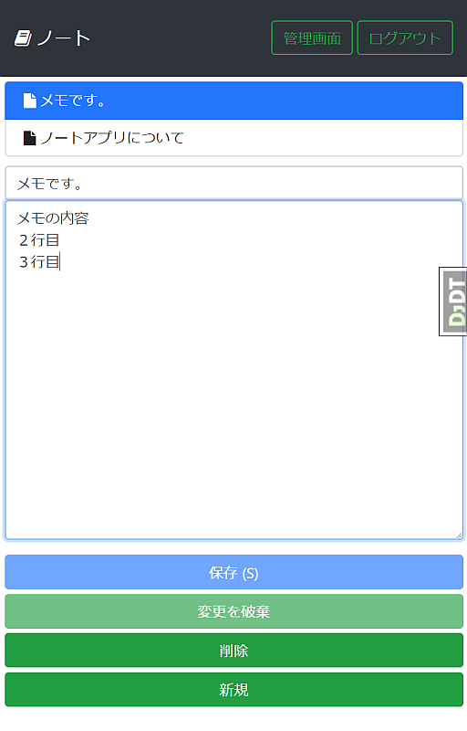

# ノートアプリケーション

## これは何ですか?

テキストを編集、保存できるシンプルなウェブアプリケーションです。

バックエンドとなるAPIサーバーにはDjangoフレームワーク(Python)、フロントエンドにはVue.js(JavaScript)を使っています。

DjangoフレームワークとJavaScriptでアプリケーションを作るサンプルコードとして作成しました。

以下の要素を含んでいます:

* バックエンド
   * Python3
   * venv
   * Djangoフレームワーク
      * Django REST Framework
      * django-debug-toolbar
* フロントエンド
   * Babel
   * webpack
   * Vue.js
   * Bootstrap
   * Font Awesome
   * mocha
   * power-assert

## 構成

* `note_server`
   * バックエンド(Pythonで動作するAPIサーバー)
* `note_client`
   * フロントエンド(webpackでビルドし、Djangoフレームワークのstaticfilesモジュールから配信される)
   * CSS(Sass)も含む

## 動かしてみる

1. `note_client` をビルドする
2. `note_server` を起動してブラウザでアクセスする

## 設計について

アーキテクチャとモジュール構成に関して考えた点など:

* シングルページアプリケーション(SPA)にはせず、DjangoのサーバーサイドレンダリングとVue.jsを組み合わせて使う
   * ビルドしたファイルの配信は、Djangoフレームワークのstaticfilesに任せる
* Vuexはなるべく使わない
   * 依存をなるべく減らす気持ち
   * Vuexは学習コストもメンテコストも高いので、使わないで済むうちは使わない
      * 複雑になったら使ったほうが楽できるとは思います
* vue-cliを使っていない
   * ごちゃっと余計なものが入るのを避ける
   * 使うツールスタックを合わせられるなら使ってもよいかな
* Vueへの依存をなるべく広げない
   * Vueに依存しないほうがテストコードを書きやすいから
   * Vueインスタンスをエントリポイント(index.js)外のJavaScriptコードに渡さない
      * エントリポイントではVueに依存しないコントローラクラスのインスタンスを生成し、データはコントローラに持たせる
   * コンポーネントから外へVueインスタンスを渡さない
   * Bootstrapのモーダルダイアログを表示する場合は、コントローラから呼び出すのではなく、コントローラからの戻り値をコンポーネント側で使って表示制御する
* django-webpack-loaderを使っていない
   * なるべく依存を増やさない
   * 必要になったら入れよう
* DjangoのCSRF対策をフロントエンドからも利用する
   * Cookieに書き込まれたCSRFトークンをAPI呼び出し時に利用しています
